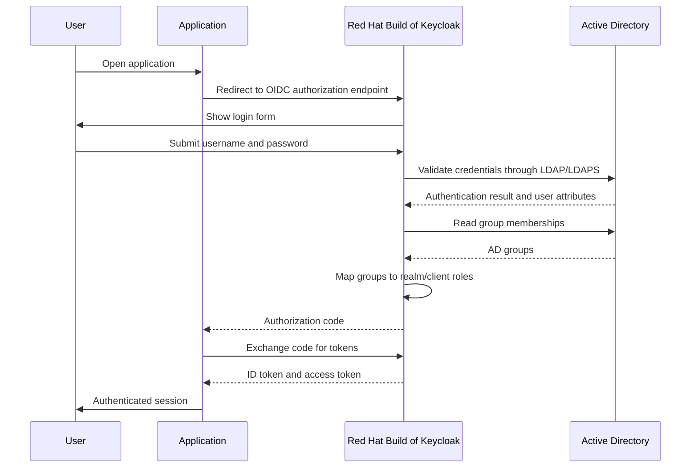
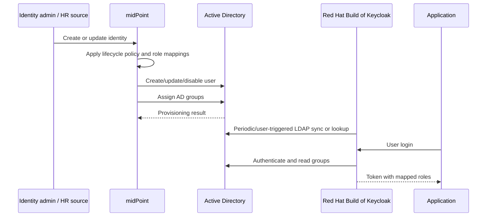
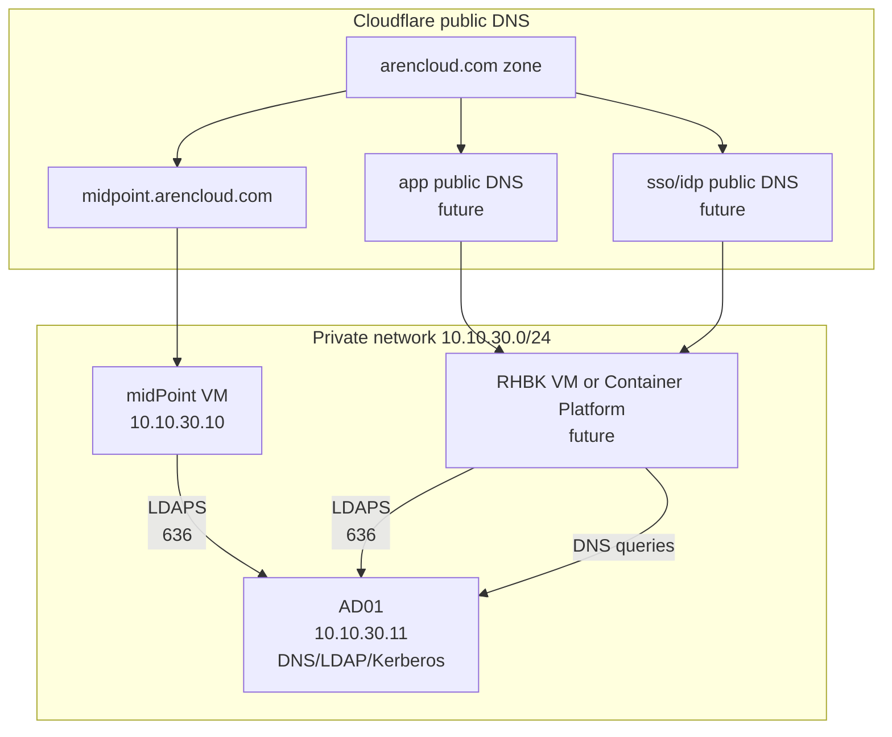
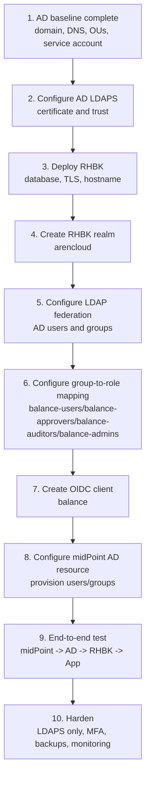

# AD + midPoint + RHBK Architecture

## Purpose

This design uses Microsoft Active Directory, Evolveum midPoint, and Red Hat Build of Keycloak to provide centralized authentication, authorization, and identity lifecycle management for applications.

The application does not authenticate users directly against Active Directory. It trusts Red Hat Build of Keycloak using OpenID Connect. midPoint manages identities and access assignments, then provisions the required users and groups into Active Directory.

## Current Infrastructure

| Component | Value |
| --- | --- |
| Active Directory domain | `ad.arencloud.com` |
| AD NetBIOS name | `ARENCLOUD` |
| Domain controller | `AD01.ad.arencloud.com` |
| Domain controller IP | `10.10.30.11` |
| midPoint URL | `https://midpoint.arencloud.com/midpoint/` |
| midPoint VM IP | `10.10.30.10` |
| Public DNS zone | `arencloud.com`, managed by Cloudflare |
| RHBK public URL | `https://sso.arencloud.com` |
| Initial application client | `balance` |

The AD domain intentionally uses `ad.arencloud.com` instead of the public root domain `arencloud.com`. This avoids conflict with Cloudflare-managed public DNS while keeping the AD namespace clearly related to the organization.

## Target Architecture

```mermaid
flowchart LR
    HR["HR / Admin Source<br/>future authoritative source"]
    MP["midPoint<br/>Identity governance<br/>Lifecycle and provisioning"]
    AD["Microsoft Active Directory<br/>ad.arencloud.com<br/>Users, groups, passwords"]
    RHBK["Red Hat Build of Keycloak<br/>Realm: arencloud<br/>OIDC/SAML provider"]
    APP["Application<br/>Uses RHBK for authn/authz"]

    HR -->|"identity data<br/>joiner/mover/leaver events"| MP
    MP -->|"provision users<br/>groups<br/>memberships"| AD
    AD -->|"LDAP/LDAPS federation<br/>password validation<br/>group lookup"| RHBK
    APP -->|"OIDC authorization request"| RHBK
    RHBK -->|"ID token<br/>access token<br/>roles/groups claims"| APP
```



## Component Responsibilities

| Component | Responsibility |
| --- | --- |
| Active Directory | Credential store, AD users, AD security groups, password validation, domain DNS |
| midPoint | Identity lifecycle, provisioning, reconciliation, role assignment, approval workflows later |
| RHBK | Login, SSO, OIDC/SAML tokens, group-to-role mapping, application-facing authorization claims |
| Application | Redirects users to RHBK, validates tokens, authorizes based on token roles/claims |

## Authentication Flow



## Provisioning Flow



## Authorization Model

Applications should authorize using RHBK roles or claims, not raw LDAP distinguished names.

Recommended AD groups:

| AD group | RHBK role | Application meaning |
| --- | --- | --- |
| `balance-users` | `balance_user` | Standard bank employee access to Balance |
| `balance-approvers` | `balance_approver` | Privileged Balance workflow approval |
| `balance-auditors` | `balance_auditor` | Read-only/reporting access |
| `balance-admins` | `balance_admin` | Balance application administration |

Recommended AD group location:

```text
OU=Groups,OU=Arencloud,DC=ad,DC=arencloud,DC=com
```

Example groups:

```text
CN=balance-users,OU=Groups,OU=Arencloud,DC=ad,DC=arencloud,DC=com
CN=balance-approvers,OU=Groups,OU=Arencloud,DC=ad,DC=arencloud,DC=com
CN=balance-auditors,OU=Groups,OU=Arencloud,DC=ad,DC=arencloud,DC=com
CN=balance-admins,OU=Groups,OU=Arencloud,DC=ad,DC=arencloud,DC=com
```

Example token shape expected by the application:

```json
{
  "preferred_username": "jdoe",
  "email": "jdoe@ad.arencloud.com",
  "realm_access": {
    "roles": ["balance_user"]
  },
  "resource_access": {
    "balance": {
      "roles": ["balance_user", "balance_approver"]
    }
  }
}
```

## RHBK Realm Design

Recommended realm:

```text
arencloud
```

Recommended LDAP federation settings:

| Setting | Value |
| --- | --- |
| Vendor | Active Directory |
| Connection URL | `ldaps://ad01.ad.arencloud.com:636` |
| Secure connection | LDAPS is configured and verified. See [AD01 LDAPS Configuration](ad01-ldaps-configuration.md). |
| Bind DN | `CN=RHBK LDAP Bind,OU=Service Accounts,OU=Arencloud,DC=ad,DC=arencloud,DC=com` |
| Users DN | `OU=Users,OU=Arencloud,DC=ad,DC=arencloud,DC=com` |
| Groups DN | `OU=Groups,OU=Arencloud,DC=ad,DC=arencloud,DC=com` |
| Username LDAP attribute | `sAMAccountName` |
| RDN LDAP attribute | `cn` |
| UUID LDAP attribute | `objectGUID` |
| User object classes | `person, organizationalPerson, user` |
| Import users | On |
| Edit mode | Read-only initially |
| Sync registrations | Off |

Client design:

| Setting | Value |
| --- | --- |
| Client ID | `balance` |
| Protocol | OpenID Connect |
| Client type | Confidential for server-side apps, public for browser-only apps |
| Redirect URIs | `https://balance.arencloud.com/*` initially |
| Web origins | `https://balance.arencloud.com` initially |
| Token content | username, email, name, roles, optional groups |

## midPoint AD Resource Design

Recommended AD resource target:

| Setting | Value |
| --- | --- |
| Host | `ad01.ad.arencloud.com` |
| LDAP port | `389`, available but not recommended for application integration |
| LDAPS port | `636`, preferred |
| Base DN | `DC=ad,DC=arencloud,DC=com` |
| Managed base | `OU=Arencloud,DC=ad,DC=arencloud,DC=com` |
| Users OU | `OU=Users,OU=Arencloud,DC=ad,DC=arencloud,DC=com` |
| Groups OU | `OU=Groups,OU=Arencloud,DC=ad,DC=arencloud,DC=com` |
| Bind DN | `CN=midPoint AD Service,OU=Service Accounts,OU=Arencloud,DC=ad,DC=arencloud,DC=com` |

The existing AD service account uses `sAMAccountName=svc_midpoint_ad`. It has delegated control over `OU=Arencloud,DC=ad,DC=arencloud,DC=com` for the lab managed subtree.

midPoint should own lifecycle operations for users and group membership in the managed OU. Direct manual changes in AD should be avoided except for break-glass administration and infrastructure accounts.

Implemented Balance provisioning behavior:

| midPoint role | AD group maintained by midPoint |
| --- | --- |
| `Balance User` | `balance-users` |
| `Balance Approver` | `balance-approvers` |
| `Balance Auditor` | `balance-auditors` |
| `Balance Admin` | `balance-admins` |

For the lab, the delegation is intentionally broad on the managed subtree so provisioning can be validated quickly. Before production, reduce this to least-privilege permissions for user lifecycle and group membership updates only.

RHBK uses a separate read-only LDAP bind account:

```text
CN=RHBK LDAP Bind,OU=Service Accounts,OU=Arencloud,DC=ad,DC=arencloud,DC=com
```

midPoint AD resource:

```text
Name: Arencloud AD
OID: 8f1c6c56-35b7-4a48-9d96-f6b6cc9f3c03
Status: connection test successful
```

## Network View



Required connectivity:

| Source | Destination | Ports | Purpose |
| --- | --- | --- | --- |
| midPoint | AD01 | `636` | Provisioning and reconciliation over LDAPS |
| midPoint | AD01 | `53` | AD DNS resolution |
| RHBK | AD01 | `636` | LDAP federation over LDAPS |
| RHBK | AD01 | `53` | AD DNS resolution |
| App users | RHBK | `443` | Login and token flow |
| App | RHBK | `443` | OIDC token exchange and JWKS |

## Build Plan



## Immediate Next Steps

1. Deploy Red Hat Build of Keycloak.
2. Create the `arencloud` realm in RHBK.
3. Configure RHBK LDAP federation to AD over LDAPS.
4. Create AD test users and groups.
5. Verify login to RHBK with an AD user.
6. Configure group-to-role mapping and inspect issued tokens.
7. Configure midPoint AD resource over LDAPS.
8. Provision a user from midPoint into AD.
9. Use the provisioned user to log into RHBK and access the application.

## Open Decisions

| Decision | Recommendation |
| --- | --- |
| RHBK hostname | Use `sso.arencloud.com` |
| RHBK deployment model | Deploy on OpenShift `cl03` with OpenShift GitOps; see [cl03 RHBK GitOps Readiness](cl03-rhbk-gitops-readiness.md). |
| RHBK database | PostgreSQL. cl03 credentials are stored in Vault; see [RHBK cl03 PostgreSQL Vault Secret](rhbk-cl03-postgresql-vault-secret.md). |
| AD transport | Use LDAPS on `636`; LDAP `389` remains available only for troubleshooting/bootstrap |
| Authorization source | AD groups managed by midPoint and mapped to RHBK roles |
| Application protocol | OpenID Connect |
| MFA | Add in RHBK after baseline login works |
