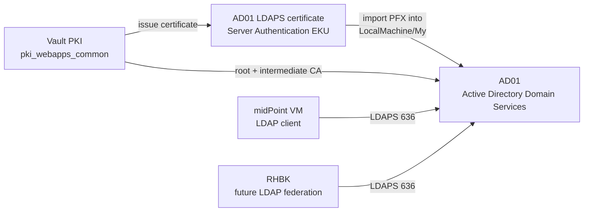
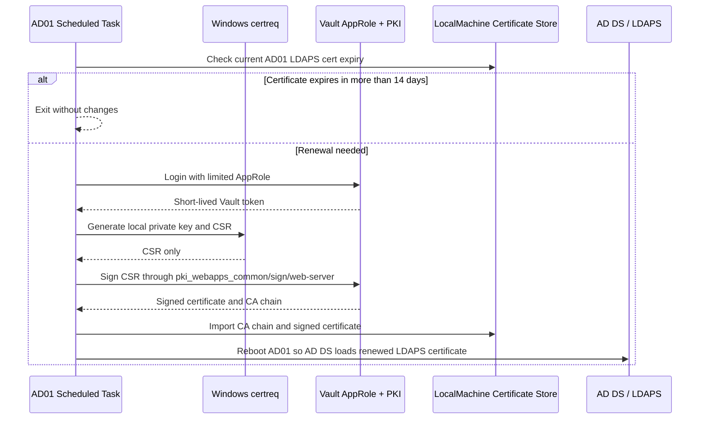

# AD01 LDAPS Configuration

## Purpose

This runbook documents how LDAPS was configured for the Active Directory domain controller `AD01.ad.arencloud.com`.

LDAPS is required so midPoint and Red Hat Build of Keycloak can connect to Active Directory over TLS instead of plain LDAP.

## Result

LDAPS is enabled and verified.

| Item | Value |
| --- | --- |
| Domain controller | `AD01.ad.arencloud.com` |
| Domain controller IP | `10.10.30.11` |
| AD domain | `ad.arencloud.com` |
| LDAPS endpoint | `ldaps://ad01.ad.arencloud.com:636` |
| Certificate issuer | `CN=intermediate_midpoint_ca` |
| Root CA | `CN=My Company Root CA` |
| Certificate source | Vault PKI mount `pki_webapps_common` |
| Certificate SANs | `ad01.ad.arencloud.com`, `ad.arencloud.com` |
| Renewal task | `\Arencloud\Renew AD01 LDAPS Certificate` |
| Renewal script | `C:\ProgramData\Arencloud\ldaps-renewal\Renew-AdLdapsCertificate.ps1` |

## Design



## Prerequisites

Active Directory must already be configured:

```text
Domain: ad.arencloud.com
Domain controller: AD01.ad.arencloud.com
IP: 10.10.30.11
```

Vault PKI must already exist:

```text
Vault URL: https://vault.svc.arencloud.com
PKI mount: pki_webapps_common
Role: web-server
Root CA: My Company Root CA
Intermediate CA: intermediate_midpoint_ca
```

The issuing role must allow names under `arencloud.com` and must allow server certificates.

## Certificate Requirements

Windows AD DS selects an LDAPS certificate from the local computer certificate store. The certificate must have:

| Requirement | Value used |
| --- | --- |
| Store | `Cert:\LocalMachine\My` |
| Private key | Required |
| EKU | Server Authentication |
| Subject | `CN=ad01.ad.arencloud.com` |
| SAN | `DNS:ad01.ad.arencloud.com`, `DNS:ad.arencloud.com` |
| Trusted chain | Vault intermediate + Vault root CA |

## Implementation Steps

### 1. Verify Existing Connectivity

From the operator machine:

```bash
nc -vz -w 5 10.10.30.11 5985
nc -vz -w 5 10.10.30.11 636
```

From the midPoint VM:

```bash
ssh egevorky@midpoint.arencloud.com \
  'for p in 389 636; do timeout 3 bash -c "</dev/tcp/ad01.ad.arencloud.com/$p" >/dev/null 2>&1 && echo $p-open || echo $p-closed; done'
```

Before certificate installation, TCP `636` was reachable but the TLS handshake reset, so LDAPS was not usable.

### 2. Issue the AD01 Certificate from Vault

Issue a certificate from the common web applications PKI mount:

```bash
VAULT_ADDR="https://vault.svc.arencloud.com"
MOUNT="pki_webapps_common"
ROLE="web-server"

curl -sS -k \
  -H "X-Vault-Token: ${VAULT_TOKEN}" \
  -H "Content-Type: application/json" \
  -X POST \
  -d '{
    "common_name": "ad01.ad.arencloud.com",
    "alt_names": "ad01.ad.arencloud.com,ad.arencloud.com",
    "ttl": "720h",
    "format": "pem"
  }' \
  "${VAULT_ADDR}/v1/${MOUNT}/issue/${ROLE}" > issue.json
```

Extract the certificate material:

```bash
jq -r '.data.certificate' issue.json > ad01-ldaps.crt
jq -r '.data.private_key' issue.json > ad01-ldaps.key
jq -r '.data.ca_chain[]?' issue.json > ca-chain.pem
```

Create a PFX for Windows import:

```bash
openssl pkcs12 -export \
  -name "AD01 LDAPS" \
  -inkey ad01-ldaps.key \
  -in ad01-ldaps.crt \
  -certfile ca-chain.pem \
  -out ad01-ldaps.pfx
```

Certificate details after issuance:

```text
subject=CN=ad01.ad.arencloud.com
issuer=CN=intermediate_midpoint_ca
SAN=DNS:ad.arencloud.com, DNS:ad01.ad.arencloud.com
EKU=TLS Web Server Authentication, TLS Web Client Authentication
```

### 3. Import CA Chain and PFX on AD01

The certificate was transferred to AD01 through a temporary internal HTTP server on the midPoint VM.

Temporary transfer source:

```text
http://10.10.30.10:18080/
```

Files transferred:

```text
ad01-ldaps.pfx
ca-1.pem
ca-2.pem
pfx-password.txt
```

PowerShell import logic on AD01:

```powershell
$dir = 'C:\ProgramData\Arencloud\ldaps'
New-Item -ItemType Directory -Force -Path $dir | Out-Null

Import-Certificate `
  -FilePath "$dir\ca-2.pem" `
  -CertStoreLocation Cert:\LocalMachine\Root

Import-Certificate `
  -FilePath "$dir\ca-1.pem" `
  -CertStoreLocation Cert:\LocalMachine\CA

$secure = ConvertTo-SecureString (Get-Content -Raw "$dir\pfx-password.txt") -AsPlainText -Force

Import-PfxCertificate `
  -FilePath "$dir\ad01-ldaps.pfx" `
  -CertStoreLocation Cert:\LocalMachine\My `
  -Password $secure `
  -Exportable:$false
```

Import result:

```text
Subject: CN=ad01.ad.arencloud.com
Issuer: CN=intermediate_midpoint_ca
HasPrivateKey: true
EnhancedKeyUsage: Server Authentication, Client Authentication
DnsNames: ad.arencloud.com, ad01.ad.arencloud.com
```

### 4. Reboot AD01

AD01 was rebooted after certificate import so Active Directory Domain Services would load the LDAPS certificate cleanly.

```powershell
Restart-Computer -Force
```

### 5. Clean Up Temporary Material

The temporary HTTP server was stopped and the temporary firewall opening on the midPoint VM was removed.

```bash
sudo firewall-cmd --remove-port=18080/tcp
```

The temporary files were removed from the midPoint VM.

On AD01, the PFX and password file were removed after import:

```powershell
Remove-Item 'C:\ProgramData\Arencloud\ldaps\ad01-ldaps.pfx' -Force
Remove-Item 'C:\ProgramData\Arencloud\ldaps\pfx-password.txt' -Force
```

The CA PEM files remain on AD01 for audit/reference:

```text
C:\ProgramData\Arencloud\ldaps\ca-1.pem
C:\ProgramData\Arencloud\ldaps\ca-2.pem
```

## Validation

### TLS Handshake

From the midPoint VM:

```bash
echo | openssl s_client \
  -connect ad01.ad.arencloud.com:636 \
  -servername ad01.ad.arencloud.com \
  -CAfile /etc/pki/ca-trust/source/anchors/vault-root-ca.pem
```

Verified output:

```text
subject=CN=ad01.ad.arencloud.com
issuer=CN=intermediate_midpoint_ca
notBefore=Jun 30 07:50:30 2026 GMT
notAfter=Jul 30 07:51:00 2026 GMT
verify return:1
DONE
```

### LDAP Bind over LDAPS

From the midPoint VM:

```bash
LDAPTLS_CACERT=/etc/pki/ca-trust/source/anchors/vault-root-ca.pem \
ldapsearch -LLL \
  -H ldaps://ad01.ad.arencloud.com:636 \
  -D "CN=midPoint AD Service,OU=Service Accounts,OU=Arencloud,DC=ad,DC=arencloud,DC=com" \
  -W \
  -b "" \
  -s base \
  defaultNamingContext dnsHostName supportedLDAPVersion
```

Verified output:

```text
dn:
supportedLDAPVersion: 3
supportedLDAPVersion: 2
dnsHostName: AD01.ad.arencloud.com
defaultNamingContext: DC=ad,DC=arencloud,DC=com
```

## Automated Renewal

AD01 LDAPS certificate renewal is automated with a Windows Scheduled Task and a limited Vault AppRole.

The automation does not store the broad Vault administrator token on AD01. It stores only a limited AppRole RoleID and SecretID that can sign CSRs through the `pki_webapps_common/sign/web-server` endpoint and read CA chain material.

### Renewal Design



### Vault AppRole

Vault policy:

```hcl
path "pki_webapps_common/sign/web-server" {
  capabilities = ["update"]
}

path "pki_webapps_common/ca_chain" {
  capabilities = ["read"]
}

path "pki_root/ca/pem" {
  capabilities = ["read"]
}
```

Vault AppRole:

```text
Role: ad01-ldaps-renewal
Policy: ad01-ldaps-renewal
Token TTL: 1h
Token max TTL: 4h
Secret ID TTL: unlimited
Secret ID uses: unlimited
```

The AppRole credentials are stored on AD01 in:

```text
C:\ProgramData\Arencloud\ldaps-renewal\vault-approle.json
```

The directory ACL is restricted to:

```text
SYSTEM: Full Control
Administrators: Full Control
```

### Windows Scheduled Task

Task:

```text
\Arencloud\Renew AD01 LDAPS Certificate
```

Schedule:

```text
Weekly, Sunday, 03:15
Run as: SYSTEM
Run level: Highest
```

Action:

```powershell
powershell.exe -NoProfile -ExecutionPolicy Bypass -File "C:\ProgramData\Arencloud\ldaps-renewal\Renew-AdLdapsCertificate.ps1"
```

The script renews only when the current matching LDAPS certificate expires within 14 days.

When renewal occurs, the script:

1. Logs into Vault using the limited AppRole.
2. Generates a local Windows private key and CSR with `certreq`.
3. Signs the CSR through Vault.
4. Imports the CA chain.
5. Accepts the signed certificate into `Cert:\LocalMachine\My`.
6. Reboots AD01 so AD DS serves the renewed LDAPS certificate.

Private keys are generated locally on AD01 and are not sent to Vault.

### Renewal Script Location

```text
C:\ProgramData\Arencloud\ldaps-renewal\Renew-AdLdapsCertificate.ps1
```

Log file:

```text
C:\ProgramData\Arencloud\ldaps-renewal\renewal.log
```

### Renewal Validation

A forced renewal test was executed with reboot suppressed:

```powershell
C:\ProgramData\Arencloud\ldaps-renewal\Renew-AdLdapsCertificate.ps1 -Force -NoReboot
```

Successful log lines:

```text
Authenticated to Vault using limited AppRole.
Generated local private key and CSR
Received signed certificate from Vault.
Imported intermediate CA: CN=intermediate_midpoint_ca
Imported root CA: CN=My Company Root CA
Installed renewed LDAPS certificate thumbprint=054A697A1061C621270854E84B9BBA7ABEB1D8E6
Renewal completed. Reboot skipped because -NoReboot was specified.
```

AD01 was then rebooted manually and LDAPS was verified to serve the renewed certificate:

```text
subject=CN=ad01.ad.arencloud.com
issuer=CN=intermediate_midpoint_ca
notBefore=Jun 30 08:11:01 2026 GMT
notAfter=Jul 30 08:11:31 2026 GMT
sha1 Fingerprint=05:4A:69:7A:10:61:C6:21:27:08:54:E8:4B:9B:BA:7A:BE:B1:D8:E6
SAN=DNS:ad.arencloud.com, DNS:ad01.ad.arencloud.com
```

Scheduled task status after installation:

```text
Task: \Arencloud\Renew AD01 LDAPS Certificate
State: Ready
Next run: Sunday 03:15
```

The scheduled task was also started manually after the forced renewal test. It ran as `SYSTEM`, exited successfully, and skipped renewal because the new certificate was still valid for more than 14 days:

```text
LastTaskResult: 0
Current LDAPS cert thumbprint=054A697A1061C621270854E84B9BBA7ABEB1D8E6
No renewal needed. Certificate is valid for more than 14 days.
```

## Client Configuration Values

Use these values for midPoint LDAP provisioning:

| Setting | Value |
| --- | --- |
| LDAP URL | `ldaps://ad01.ad.arencloud.com:636` |
| Base DN | `DC=ad,DC=arencloud,DC=com` |
| Users DN | `OU=Users,OU=Arencloud,DC=ad,DC=arencloud,DC=com` |
| Groups DN | `OU=Groups,OU=Arencloud,DC=ad,DC=arencloud,DC=com` |
| Bind DN | `CN=midPoint AD Service,OU=Service Accounts,OU=Arencloud,DC=ad,DC=arencloud,DC=com` |
| CA trust | Vault root CA, `CN=My Company Root CA` |

Use these values for RHBK LDAP federation:

| Setting | Value |
| --- | --- |
| LDAP URL | `ldaps://ad01.ad.arencloud.com:636` |
| Users DN | `OU=Users,OU=Arencloud,DC=ad,DC=arencloud,DC=com` |
| Groups DN | `OU=Groups,OU=Arencloud,DC=ad,DC=arencloud,DC=com` |
| Bind DN | `CN=RHBK LDAP Bind,OU=Service Accounts,OU=Arencloud,DC=ad,DC=arencloud,DC=com` |
| Bind credential source | Vault path `arencloud/cl03/rhbk/ad-bind`, key `bindCredential` |
| CA trust | Vault root CA, `CN=My Company Root CA` |

## Operational Notes

- The AD01 LDAPS certificate is issued with a 30-day TTL.
- Renewal is automated through the AD01 scheduled task described above.
- The renewal task renews when the current certificate has 14 days or less remaining.
- AD01 reboots automatically only after an actual renewal.
- RHBK and midPoint must trust the Vault root CA.
- midPoint VM already trusts the Vault root CA at `/etc/pki/ca-trust/source/anchors/vault-root-ca.pem`.
- Use the FQDN `ad01.ad.arencloud.com` for LDAPS. Do not connect with the short name `AD01`, because the short name is not in the certificate SAN.
